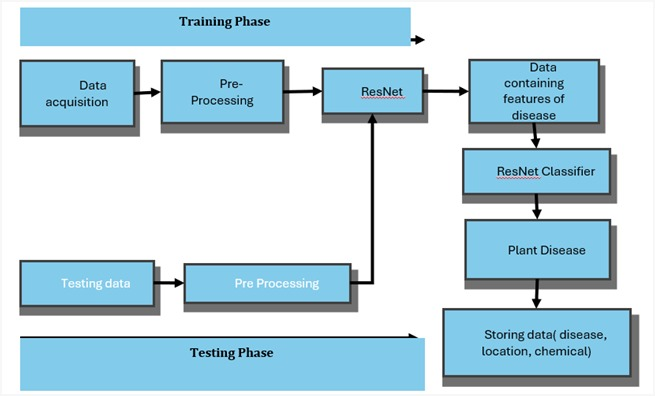
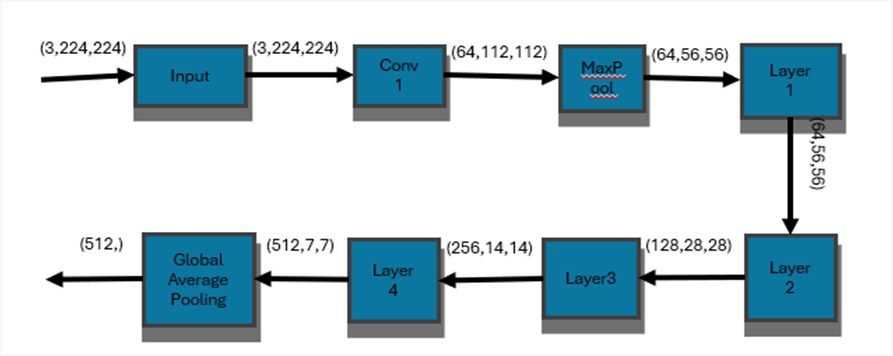
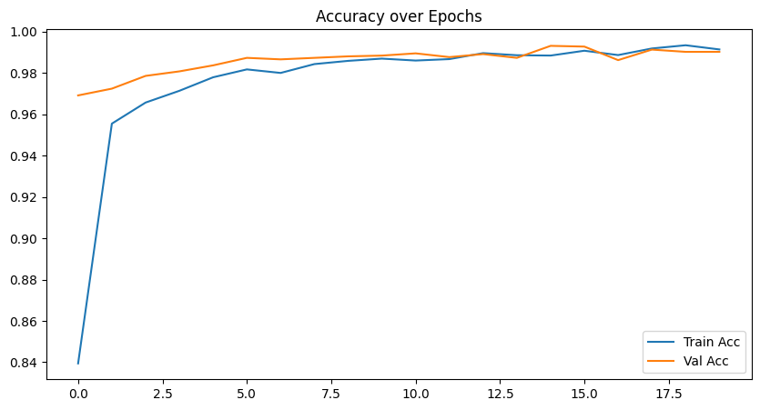
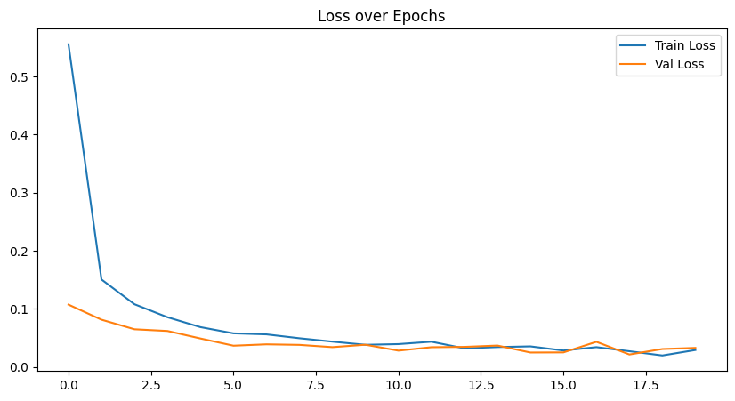

# Deep-Learning-Based-GPS-Guided-Drone-for-Tomato-Crop-Disease-Detection-in-Precision-Agriculture
AI-powered autonomous GPS-guided drone for tomato crop disease detection using Raspberry Pi, Pixhawk, camera, and ResNet deep learning. Enables real-time crop monitoring, disease classification, GPS mapping, and precision agriculture for smarter farming.

## Project Overview
Agriculture plays a vital role in the global economy, but crop diseases significantly reduce productivity and crop quality. Tomato crops are highly vulnerable to multiple bacterial, fungal, viral, and pest-related diseases that can spread rapidly if not detected early.

This final year project presents an **AI-powered autonomous drone system** designed to monitor tomato crops, detect diseases in real-time, and support precision agriculture practices.

The system integrates:

- **Pixhawk / APM 2.8.6 Flight Controller**
- **GPS Module for autonomous navigation**
- **Raspberry Pi 5 for onboard processing**
- **Camera Module for image acquisition**
- **ResNet Deep Learning Model for disease classification**
- **Mission Planner Software for flight path planning**

The drone autonomously follows predefined GPS waypoints, captures high-resolution images of tomato plants, analyzes them using deep learning, identifies diseased plants, records GPS coordinates of infected regions, and suggests suitable treatment solutions.

---

## Team Members

This project was successfully developed as a final year academic project by:

- **Guni Reddy Charan Kumar Reddy** (22AT1A0451)
- **Kadamurugandla Sri Guru Datta** (22AT1A0463)
- **Bekkasula Vinay** (22AT1A0414)

---

## Academic Guidance

**Project Supervisor:**  
Dr. K.C.T. Swamy, M.E., Ph.D.  
Professor, Department of Electronics and Communication Engineering  
G. Pullaiah College of Engineering and Technology, Kurnool

---

## System Architecture

The following block diagram represents the hardware integration of the autonomous drone system used for tomato crop disease detection:

### Architecture Description:

- **Camera Module:** Captures real-time aerial images of tomato crops
- **Raspberry Pi:** Processes captured images using the ResNet deep learning model
- **Pixhawk Flight Controller:** Controls drone navigation, stabilization, and waypoint execution
- **Telemetry Module:** Provides wireless communication between drone and ground station
- **Battery:** Main power source for the drone system
- **UBEC 5A:** Supplies regulated power to Raspberry Pi and control electronics
- **Power Module:** Monitors voltage/current and powers Pixhawk
- **Power Distribution Board:** Distributes battery power to ESCs
- **ESCs (Electronic Speed Controllers):** Control motor speeds
- **Brushless Motors:** Enable drone flight and movement

## Mission Planner Setup and GPS Waypoint Path Configuration

Mission Planner software is used to define the autonomous flight path for the drone before deployment in agricultural fields.

### Steps to Set Path in Mission Planner

1. **Connect Pixhawk Flight Controller**
   - Connect Pixhawk/APM 2.8.6 to laptop via telemetry
   - Open Mission Planner software
   - Select appropriate COM port
   - Click **Connect**

2. **Calibrate Drone Components**
   - Accelerometer calibration
   - Compass calibration
   - Radio calibration
   - ESC calibration

3. **Configure Flight Mode**
   - Set flight mode to **AUTO**
   - Enable GPS lock
   - Verify satellite connection

4. **Open Flight Plan Tab**
   - Navigate to **Flight Plan**
   - Select agricultural field location on the map
   - Use the map interface to mark waypoints manually

5. **Set GPS Waypoints**
   - Add multiple waypoints across the tomato crop field
   - Define:
     - Latitude
     - Longitude
     - Altitude

6. **Assign Commands**
   - TAKEOFF
   - WAYPOINT
   - LOITER (optional)
   - LAND / RTL (Return to Launch)

7. **Write Mission to Drone**
   - Click **Write WPs**
   - Upload flight path to Pixhawk

8. **Start Autonomous Mission**
   - Arm drone
   - Switch to AUTO mode
   - Drone follows predefined path automatically

---
## Deep Learning Model: ResNet Architecture

The disease detection system uses the **Residual Network (ResNet)** deep learning architecture for accurate classification of tomato crop diseases.

### Why ResNet?

ResNet was selected because of its:

- High classification accuracy
- Ability to train deep neural networks efficiently
- Residual learning to overcome vanishing gradient problems
- Strong feature extraction capability
- Excellent performance in agricultural image classification

---

### Training and Testing Pipeline

#### Training Phase:
- Data acquisition
- Image preprocessing
- Data augmentation
- ResNet training
- Feature extraction
- Disease classification

#### Testing Phase:
- Test image preprocessing
- Disease prediction
- GPS location mapping
- Chemical treatment recommendation
- Data storage

---

### ResNet Workflow

1. **Input Layer**
   - Tomato leaf images resized to 224x224x3

2. **Convolution Layer**
   - Feature extraction from leaf images

3. **Max Pooling Layer**
   - Reduces feature dimensions

4. **Residual Layers**
   - Layer 1
   - Layer 2
   - Layer 3
   - Layer 4

5. **Global Average Pooling**
   - Converts extracted features into classification vector

6. **Fully Connected Classifier**
   - Identifies disease category

---

## Performance Evaluation

The model was evaluated using:

### Accuracy Graph
- Shows training and validation accuracy progression
- Achieved approximately **99% classification accuracy**

### Loss Graph
- Demonstrates reduction in training and validation loss
- Indicates effective convergence

### Confusion Matrix
- Visualizes classification performance across all disease classes
- Confirms strong prediction reliability

---

## Evaluation Metrics

- Accuracy
- Precision
- Recall
- F1 Score
- Confusion Matrix
- Training Loss
- Validation Loss

---
## Objectives

- Early detection of tomato crop diseases
- Reduce manual labor in agricultural monitoring
- Minimize excessive pesticide usage
- Improve crop productivity
- Enable GPS-based infected plant mapping
- Support sustainable precision agriculture

---

## Key Features

- Autonomous drone navigation
- GPS waypoint-based flight control
- Real-time crop monitoring
- Tomato leaf disease detection using ResNet CNN
- GPS tagging of infected plants
- Disease classification with ~99% accuracy
- Precision treatment recommendations
- Data logging for future agricultural analysis

---

## Tomato Diseases Detected

- Bacterial Spot
- Early Blight
- Late Blight
- Leaf Mold
- Septoria Leaf Spot
- Spider Mites (Two-Spotted Spider Mite)
- Target Spot
- Tomato Yellow Leaf Curl Virus (TYLCV)
- Tomato Mosaic Virus
- Healthy Tomato Leaves

---

## Hardware Components

- Pixhawk /  2.4.8 Flight Controller
- GPS Module
- Raspberry Pi 5
- Camera Module
- Brushless Motors
- ESCs (Electronic Speed Controllers)
- Telemetry Module
- BEC Module
- Li-Po Battery (5400mAh 4S)
- Drone Frame

---

## Software & Technologies Used

### Programming:
- Python
- OpenCV
- PyTorch

### Deep Learning:
- ResNet Architecture
- CNN Classification
- Data Augmentation
- Image Preprocessing

---

## System Workflow

1. Mission Planner defines GPS waypoints
2. Drone autonomously flies over an agricultural field
3. Camera captures crop images
4. Raspberry Pi processes images
5. ResNet model detects disease
6. GPS coordinates are recorded
7. Disease type is classified
8. Treatment suggestions are generated
9. Data is stored for precision farming

---

## Model Performance

- **Model:** ResNet
- **Accuracy:** ~99%
- **Metrics Used:**
  - Confusion Matrix
  - Accuracy Curve
  - Loss Curve
  - Validation Performance

---

## Applications

- Precision Agriculture
- Smart Farming
- Crop Disease Monitoring
- Precision Pesticide Spraying
- Agricultural Research
- Crop Yield Optimization

---

## Advantages

- Reduces manual crop inspection
- Saves time and labor
- High disease detection accuracy
- Minimizes pesticide wastage
- Improves sustainability
- Supports targeted treatment
- Enhances farm productivity

---

## Future Scope

- Automated pesticide spraying integration
- IoT dashboard for farmers
- Mobile application alerts
- Multi-crop disease detection
- 5G drone communication
- Swarm drone deployment
- Cloud-based agricultural analytics

---

